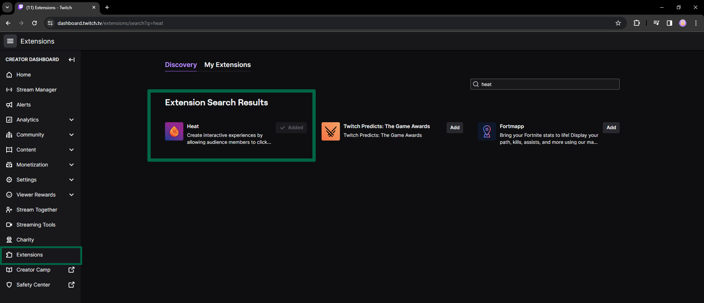
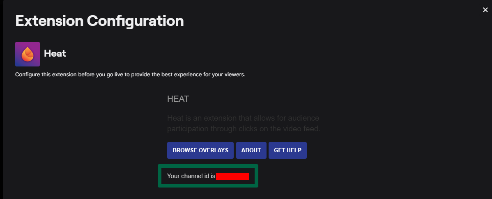
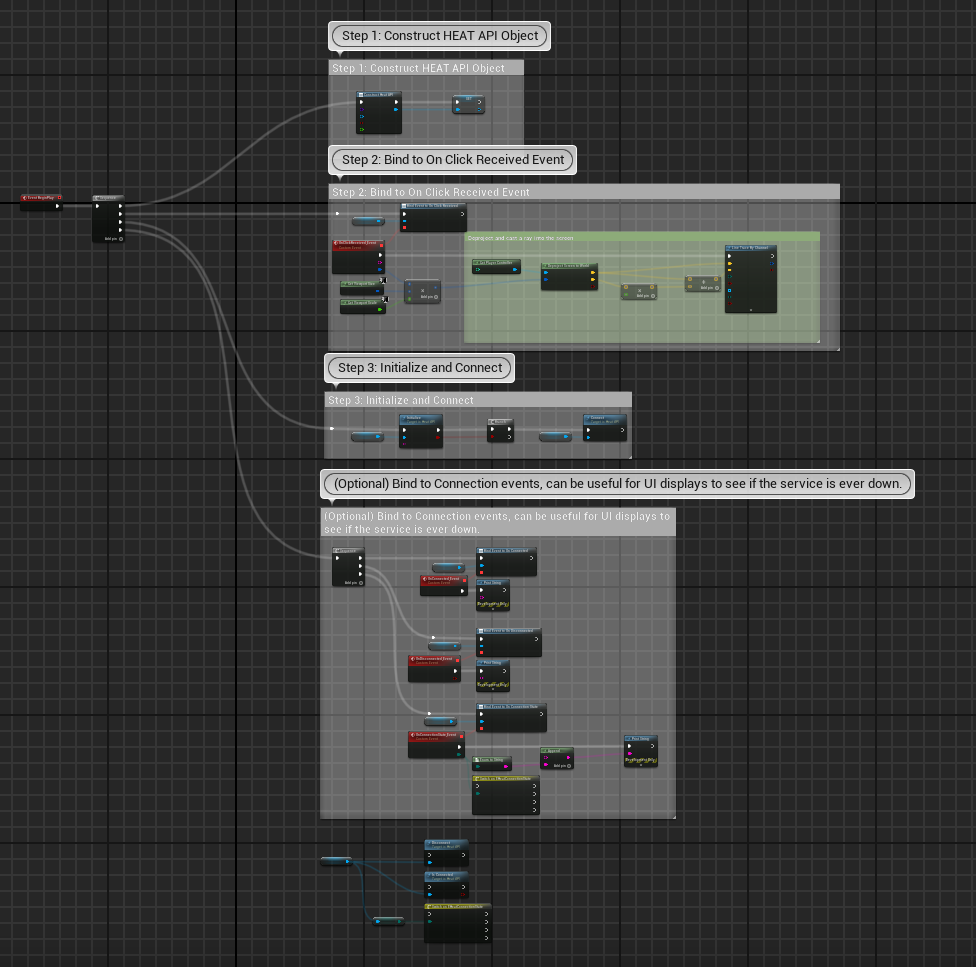
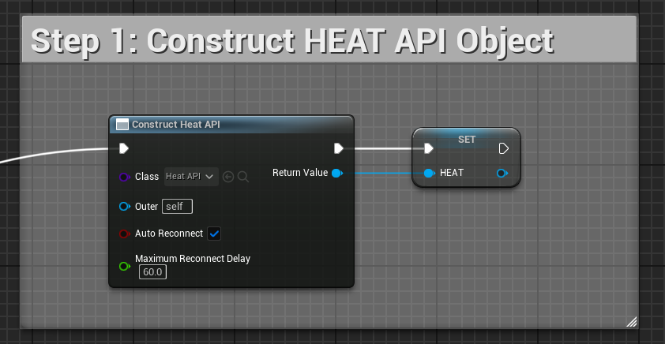
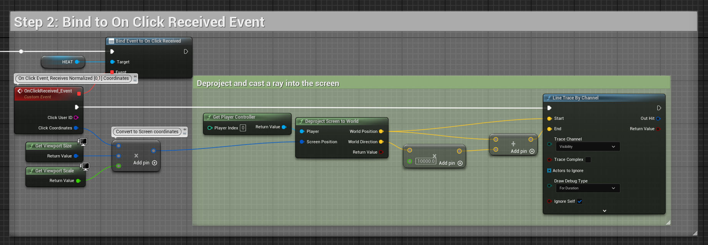
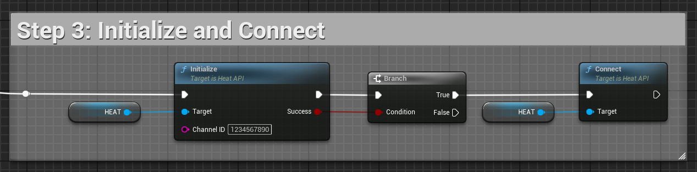
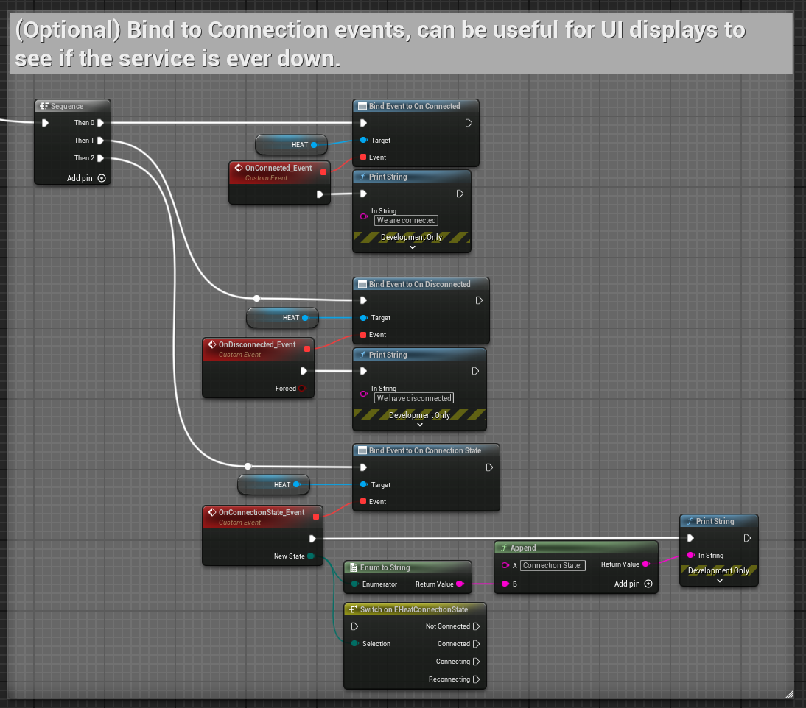
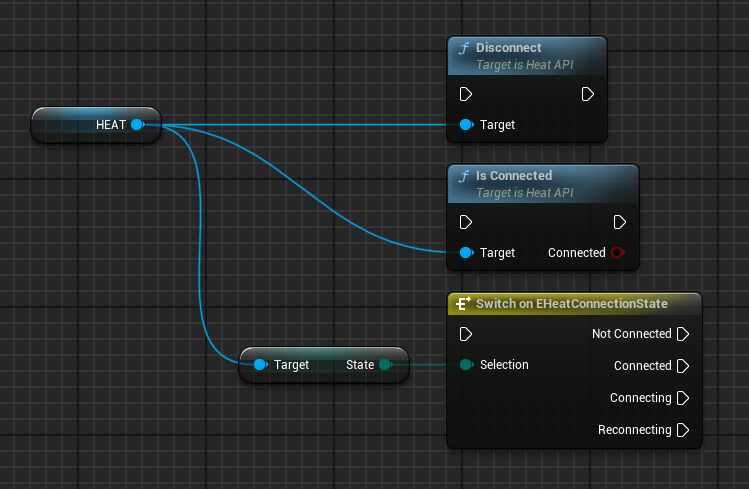

# Twitch HEAT Plugin for Unreal Engine
Provides an Unreal Engine 5 plugin to interact with Live Twitch Streams via the Heat Extension  

For more information about HEAT, see  
https://heat.j38.net/  
https://github.com/scottgarner/Heat/wiki/

### NOTE: Twitch Mobile App users CANNOT interact with this. This is only functional in web browsers supporting Twitch Overlay Extensions (probably not mobile browsers), as the HEAT extensions requires the user to click on the stream itself.

## Installation
Unzip to your projects Plugins directory, such that it's path is  
**ProjectRoot/Plugins/TwitchHEAT**  

Or to your engine plugins directory, wherever you see fit.  

Check the [Unreal documentation](https://docs.unrealengine.com/5.3/en-US/plugins-in-unreal-engine/#pluginfolders) for more information on where to do this.  

### Activate the HEAT extension for twitch through your creator dashboard

### Configure the HEAT extension for twitch to find your Channel ID for use with the API

## An overview of the whole node API
There are 3 steps to using this plugin.

### Step 1: Create the TwitchHEAT object, and store it
This object encapsulates a websocket connection to the HEAT servers.  
Create a new object for every channel you wish to listen to.  

### Step 2: Bind to the OnClickReceived Event
It returns normalized screen coordinates, and the twitch UserID (not name) of who clicked. We can convert these normalized [0,1] coordinates into screen resolution coordinates, and then find the world point, and direction into the world of a ray, through Deprojection.  
This does not have to be done before step 3.  

### Step 3: Initialize the object and Connect
You need the Twitch ID of the channel to listen to. This channel MUST have the HEAT extension enabled and active as an Overlay to function. See [Installation](#installation) for details.

### Optional: Bind to connection events
Can be useful to monitor status in the UI.  

### Other Nodes
Disconnect, IsConnected, and the current State enum.  

